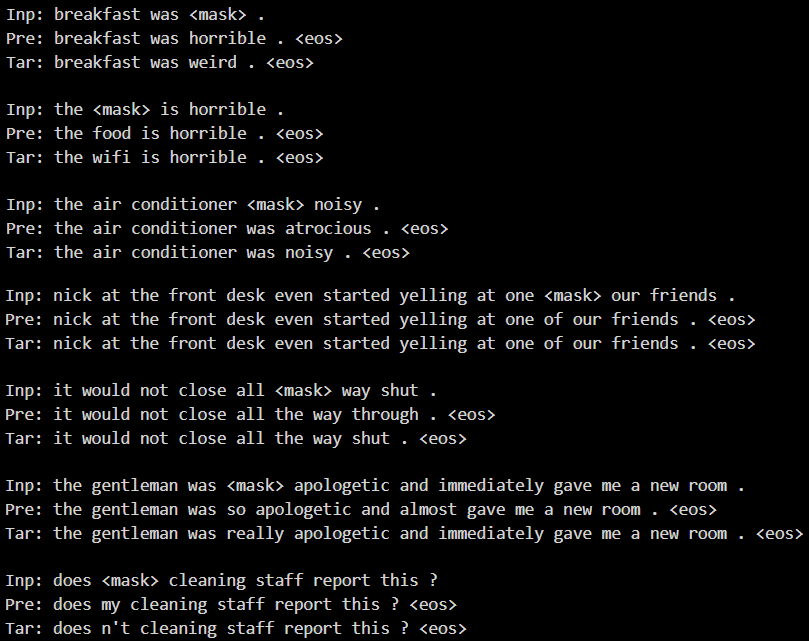

# Text Infilling


## About The Project


### Introduction

My project is called **Text Infilling**. This is a model which helps to fill in the missing word of a sentence.

## Getting Started

To get started, you should have prior knowledge on **Python** and **Pytorch** at first. A few resources to get you started if this is your first Python or Tensorflow project:

- [Pytorch Tutorials](https://pytorch.org/tutorials/)
- [Python for Beginners](https://www.python.org/about/gettingstarted/)


## Installation and Run

1. Clone the repo

   ```sh
   git clone https://github.com/phkhanhtrinh23/text_infilling.git
   ```
  
2. Use any code editor to open the folder **text_infilling**.


## Step-by-step

1. Read and run `data.py` or `collocation_data.py` to create data with `<mask>` token filled at random `i`-th token in the sentence.

2. Read and run `train.py` to train the **Seq2seq VAE** model. The data are generated at each epoch for better generalization.

## Results


Description:
- `Inp`: the input data.
- `Pre`: the prediction from the model.
- `Tar`: the target data (groundtruth).
*Note: `<eos>` is just the end-of-sentence token.*


## Contribution

Contributions are what make GitHub such an amazing place to be learn, inspire, and create. Any contributions you make are greatly appreciated.

1. Fork the project
2. Create your Contribute branch: `git checkout -b contribute/Contribute`
3. Commit your changes: `git commit -m 'add your messages'`
4. Push to the branch: `git push origin contribute/Contribute`
5. Open a pull request


## Contact

Email: phkhanhtrinh23@gmail.com

Project Link: https://github.com/phkhanhtrinh23/text_infilling.git